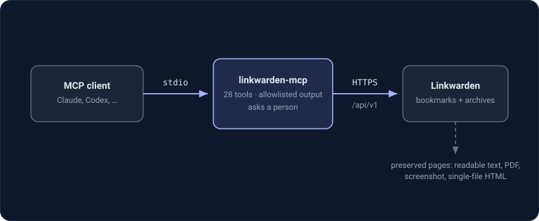

# linkwarden-mcp

[](https://github.com/ni-c/linkwarden-mcp/actions/workflows/ci.yml)
[](https://www.npmjs.com/package/linkwarden-mcp)
[](https://www.npmjs.com/package/linkwarden-mcp)
[](https://github.com/ni-c/linkwarden-mcp/pkgs/container/linkwarden-mcp)
[](https://nodejs.org)
[](LICENSE)
[](https://linkwarden-mcp.ni-c.de)

A [Model Context Protocol](https://modelcontextprotocol.io) server for
[Linkwarden](https://linkwarden.app), the self-hosted bookmark manager that keeps a
permanent copy of every page it saves.

It lets an MCP client — Claude Code, Claude Desktop, Codex — search a bookmark
collection, organise it into collections and tags, and **read the preserved article
text of a saved page**, so a link that has been archived can be summarised or quoted
without fetching the live site again.

📖 **[Full documentation at linkwarden-mcp.ni-c.de](https://linkwarden-mcp.ni-c.de)**




> **Note:** Linkwarden's published API reference is incomplete. This server was
> written against the routes in `apps/web/pages/api/v1/**` and the request schemas in
> `packages/lib/schemaValidation.ts` of
> [linkwarden/linkwarden](https://github.com/linkwarden/linkwarden), verified against
> **v2.16.0** on 2026-08-17. Those two files are the source of truth for every tool
> here.

## Requirements

- Node.js ≥ 22
- A running Linkwarden instance
- An access token, created under **Settings → Access Tokens**

Linkwarden has no per-token scopes: a token carries the full permissions of the
account that created it. Create a dedicated account with access only to the
collections this server should see rather than handing it an admin token.

## Configuration

| Variable                  | Required | Description                                                         |
| ------------------------- | -------- | ------------------------------------------------------------------- |
| `LINKWARDEN_URL`          | yes      | Base URL, e.g. `https://links.example.net` (without `/api/v1`)      |
| `LINKWARDEN_TOKEN`        | yes      | Access token from Settings → Access Tokens                          |
| `LINKWARDEN_READ_ONLY`    | no       | `true` registers only the read tools                                |
| `LINKWARDEN_INSECURE_TLS` | no       | `true` accepts self-signed certificates (scoped to this connection) |

> **Use `https://`.** Over plain http the token travels unencrypted; the server prints
> a warning unless the host is local. For a self-signed certificate prefer a proper
> internal CA over `LINKWARDEN_INSECURE_TLS`.

The token is removed from the process environment once it has been read, so it is not
visible to child processes or in `/proc/<pid>/environ`.

Without credentials the server still starts and lists its tools, so registries and
inspectors can introspect it; every call then fails with setup instructions instead of
reaching the API.

## Installation

### Claude Code

```sh
claude mcp add linkwarden -e LINKWARDEN_URL=https://links.example.net -e LINKWARDEN_TOKEN=… -- npx -y linkwarden-mcp
```

### Claude Desktop

```json
{
  "mcpServers": {
    "linkwarden": {
      "command": "npx",
      "args": ["-y", "linkwarden-mcp"],
      "env": {
        "LINKWARDEN_URL": "https://links.example.net",
        "LINKWARDEN_TOKEN": "…"
      }
    }
  }
}
```

### Codex

```toml
[mcp_servers.linkwarden]
command = "npx"
args = ["-y", "linkwarden-mcp"]
env = { LINKWARDEN_URL = "https://links.example.net", LINKWARDEN_TOKEN = "…" }
```

### From source

```sh
npm install && npm run build
LINKWARDEN_URL=https://links.example.net LINKWARDEN_TOKEN=… node dist/index.js
```

### Docker

```sh
docker build -t linkwarden-mcp .
docker run --rm -i \
  -e LINKWARDEN_URL=https://links.example.net \
  -e LINKWARDEN_TOKEN=… \
  linkwarden-mcp
```

## Tools

### Reading

| Tool                     | Description                                                                                              |
| ------------------------ | -------------------------------------------------------------------------------------------------------- |
| `search_links`           | Search or list bookmarks. Supports Linkwarden's field filters (`tag:`, `collection:`, `before:`, `!` …). |
| `get_link`               | One bookmark with its tags, collection and which preserved formats exist.                                |
| `get_link_content`       | The preserved article text of a saved page, sliced for long articles.                                    |
| `list_collections`       | All collections with link counts; nesting via `parentId`.                                                |
| `get_collection`         | One collection with its per-member permissions.                                                          |
| `list_tags`              | Tags with link counts and their per-tag archival settings.                                               |
| `get_tag`                | One tag.                                                                                                 |
| `get_dashboard`          | Recently added plus pinned links, as Linkwarden's dashboard shows them.                                  |
| `list_rss_subscriptions` | The RSS feeds this account subscribes to.                                                                |
| `get_current_user`       | Which account the token belongs to, and its archival defaults. Good connectivity check.                  |
| `get_worker_stats`       | Preservation and search-index queue. **Administrator account only** — everyone else gets HTTP 403.       |

### Writing

Not registered at all when `LINKWARDEN_READ_ONLY=true`. Tools marked 🔒 require a
confirmation token.

| Tool                           | Description                                                                  |
| ------------------------------ | ---------------------------------------------------------------------------- |
| `create_link`                  | Save a bookmark, optionally with tags and a collection (created on demand).  |
| `update_link`                  | Change title, description, tags or collection. 🔒 only when the URL changes. |
| `set_link_pinned`              | Pin or unpin a link for this account.                                        |
| `delete_link` 🔒               | Delete a bookmark and its preserved copies.                                  |
| `bulk_update_links` 🔒         | Apply one tag list and/or collection to many links.                          |
| `bulk_delete_links` 🔒         | Delete many bookmarks at once.                                               |
| `represerve_link` 🔒           | Drop the existing archives and preserve the page again.                      |
| `delete_link_preservations` 🔒 | Drop the archives of several links, keeping the bookmarks.                   |
| `create_collection`            | Create a collection, optionally nested.                                      |
| `update_collection`            | Rename, re-parent or publish a collection. 🔒 only when publishing.          |
| `delete_collection` 🔒         | Delete a collection — cascades to its links and sub-collections.             |
| `create_tags`                  | Create tags or change their archival settings (upsert by name).              |
| `rename_tag`                   | Rename a tag.                                                                |
| `delete_tags` 🔒               | Delete tags; the links keep existing.                                        |
| `merge_tags` 🔒                | Fold several tags into one new tag.                                          |
| `create_rss_subscription`      | Subscribe to an RSS/Atom feed.                                               |
| `delete_rss_subscription` 🔒   | Stop polling a feed.                                                         |

### Deliberately not exposed

- **Access-token management** (`/tokens`). A tool that can mint API credentials is a
  privilege-escalation surface, and a bookmark server has no business holding one.
- **User administration** (`/users`, account deletion). Out of scope.
- **Backup export and import** (`/migration`). The export dumps the whole instance
  into the model's context; the import can destroy it.
- **Highlights.** Creating one needs exact character offsets into the preserved
  document, which a model cannot produce meaningfully, and Linkwarden offers no route
  to list existing highlights.
- **Archive uploads** and the signed `preserved` URLs, which need
  `NEXT_PUBLIC_USER_CONTENT_DOMAIN` to be configured.
- The deprecated `GET /links` listing route — `search_links` uses `GET /search`
  instead, which is what Linkwarden itself recommends.

## Safety

- **Destructive tools are two-step.** The first call returns a short-lived
  confirmation token bound to the exact target; only a second call carrying that token
  performs the operation. A model cannot satisfy this gate on its own, and a token
  issued for one link, tag set or change cannot be replayed for another.
- **Widening visibility counts as destructive.** Publishing a collection and changing
  a link's URL — which deletes every preserved copy of the old page — both need a
  confirmation, not just deletions.
- **Confirmation prompts never quote content from Linkwarden.** Titles, URLs,
  descriptions and collection names come from saved pages and from other users of the
  instance; only counts and ids appear in the text a model reads.
- **Returned content is marked as untrusted data**, in particular the preserved
  article text, which is written by whoever controls the target site.
- **Partial updates never clear fields.** Linkwarden's update routes replace the whole
  record, so this server reads the current state and merges — otherwise an update
  would silently strip a link's tags or a collection's collaborators.
- **A 200 is not trusted on its own.** Several Linkwarden routes report failures with
  HTTP 200 and an error sentence in the body, and a route without a handler for the
  method used answers 200 with nothing at all. Both are reported as errors rather than
  as a successful write.
- Error bodies are truncated, HTML error pages are dropped entirely, redirects are
  never followed (so the bearer token cannot be replayed to another host), and every
  request carries a timeout.
- `LINKWARDEN_READ_ONLY=true` does not register the write tools at all.
- **Residual risk:** within the permissions of the token you configure, a model that
  is asked to do something destructive and is confirmed by a user can still do it.
  Scope the account, and keep host-level permission prompts on.

## Development

```sh
npm install
npm run build
npm test
npm run test:coverage
npm run lint
npm run format
npm run docs:tools     # regenerate docs/reference/tools.md from the registered tools
```

`docs/reference/tools.md` is generated; CI fails if the committed copy no longer
matches the code. The documentation site lives in `docs/` with **its own**
`package.json` and lockfile — VitePress must not end up in the root install, which runs
in the Docker build and across the whole test matrix.

See [CONTRIBUTING.md](CONTRIBUTING.md).

## Releasing

Everything is driven by a tag; there is no manual publish step.

1. Move the `[Unreleased]` section of [CHANGELOG.md](CHANGELOG.md) to the new version
   and date it. The release workflow extracts that section with `awk`, so the
   `## [x.y.z]` heading shape matters.
2. Bump `version` in `package.json`.
3. `npm run lint && npm run build && npm run test:coverage`.
4. Commit, then a **signed annotated** tag:

   ```sh
   git tag -s v0.1.1 -m "v0.1.1"
   git push origin main v0.1.1
   ```

`release.yml` then verifies the tag matches `package.json`, publishes to npm over
**Trusted Publishing** (OIDC — no npm token exists to leak) with provenance, syncs the
version into both `server.json` package entries, publishes to the MCP registry, and
cuts the GitHub release from the changelog section. `ci.yml` pushes the multi-arch
container image to GHCR in parallel.

If the registry step fails, fix it on `main` and run the `mcp-registry.yml` workflow by
hand. Re-running the failed job is not an option: it checks out the immutable tag, so a
fix on `main` could never reach it.

## License

[MIT](LICENSE) © Willi Thiel
